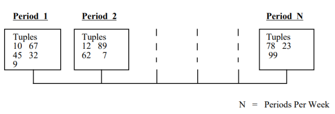
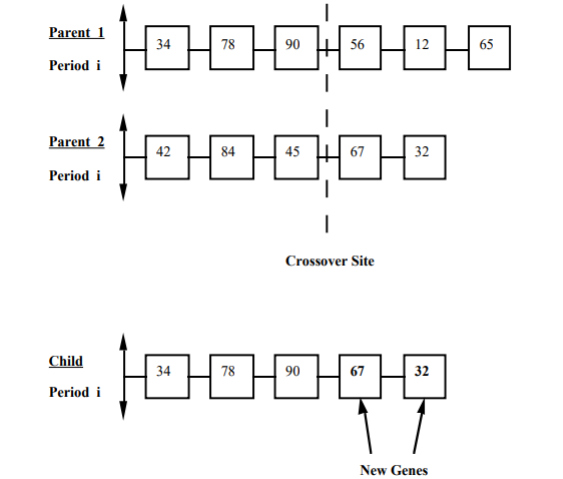
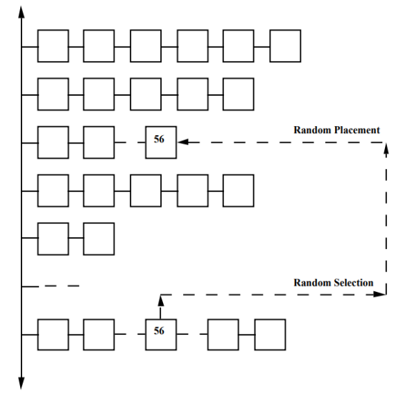

# Planner

The problem of designing a class schedule involves distributing activities into predefined time slots in such a way that
no teacher, class, or room repeats in a given time slot. An example of a time slot is "Monday 8:00-9:30", with the
activity: "Dr. inż. Gronek, Parallel and Distributed Systems, D-10 204".

To simplify the algorithm, it is assumed that time periods are of equal length, and the duration of each activity is
equal to the length of a time slot.

The algorithm used and the definition of the problem are more suitable for recurring class schedules (e.g., weekly),
which are most common in schools.

Developer documentation is available at [https://wfiis-is.github.io/Planner/](https://wfiis-is.github.io/Planner/).

## Usage

```bash
mvn java:exec
```

## Definitions

* Class: A planned group of students. It is assumed that students' membership in groups is constant and does not change.
  Additionally, a student cannot belong to multiple groups (groups are disjoint).
* Subject: What is taught during a given time period. It is possible for a subject to appear more than once in a week.
* Tuple: A combination of teacher, subject, class, and room. A tuple may occur more than once in a week.

## Implementation

The class schedule is represented by a collection of time periods of a fixed size equal to `number_of_periods`. Each
period consists of a period identifier and an array of dynamically sized identifiers of tuples. This representation
allows easy detection of scheduling conflicts, such as two tuples with the same teacher occurring in the same time
period.



## Genetic Approach

In the genetic approach, a solution is represented as an individual composed of a set of chromosomes. Each chromosome
contains a certain number of genes.

For the class schedule problem, we adopt the genetic terminology described
in
> Abramson, D., & Abela, J. (1992). A Parallel Genetic Algorithm for Solving the School Timetabling Problem.
> High Performance Computation Project, Division of Information Technology, C.S.I.R.O., 723 Swanston St,
> Carlton, 3053, Australia.

specifically:

* Individual: An arranged class schedule
* Chromosome: A specific time period
* Gene: A single tuple

### Crossover of Individuals

Crossover of individuals begins with selecting two random but appropriately adapted individuals as parents. Then, for
each chromosome, a point is determined to divide the set of genes into two parts. The child inherits one part of the
genes from each parent, as shown in the following figure.

The defined crossover may result in the loss or duplication of tuples and thus activities. After creating a new
individual, lost tuples must be restored by adding them to a random chromosome and duplicates removed.



### Mutation

Mutation involves moving a randomly selected gene from a random chromosome to another random chromosome within the same
individual. Below figure visualizes this process.

